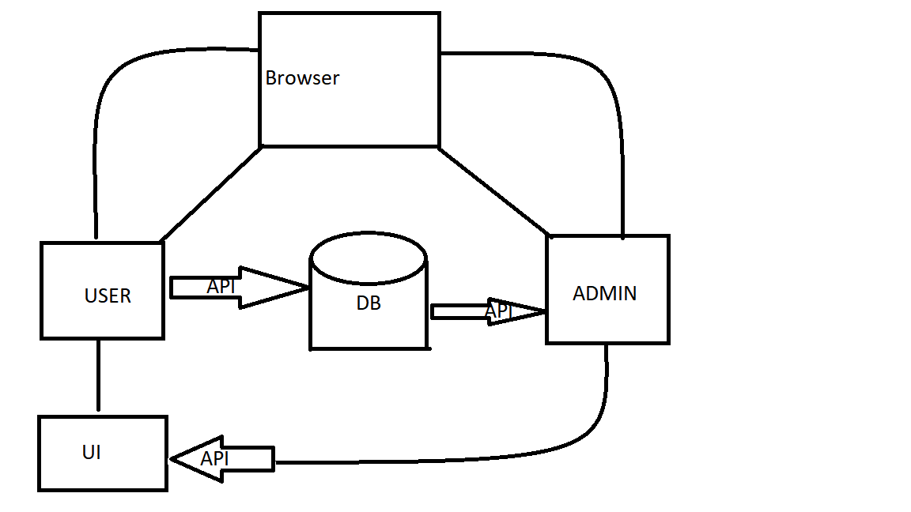
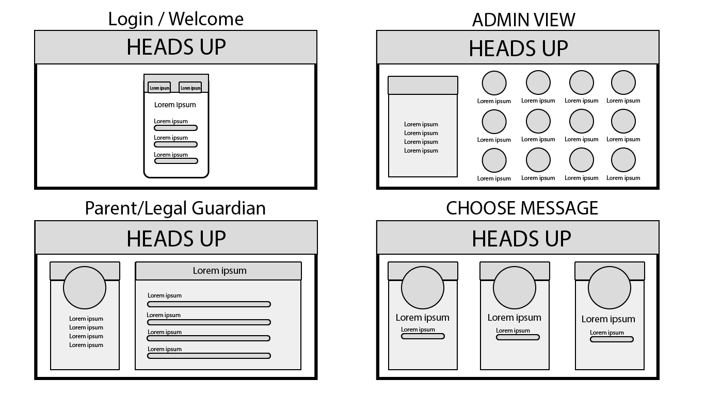
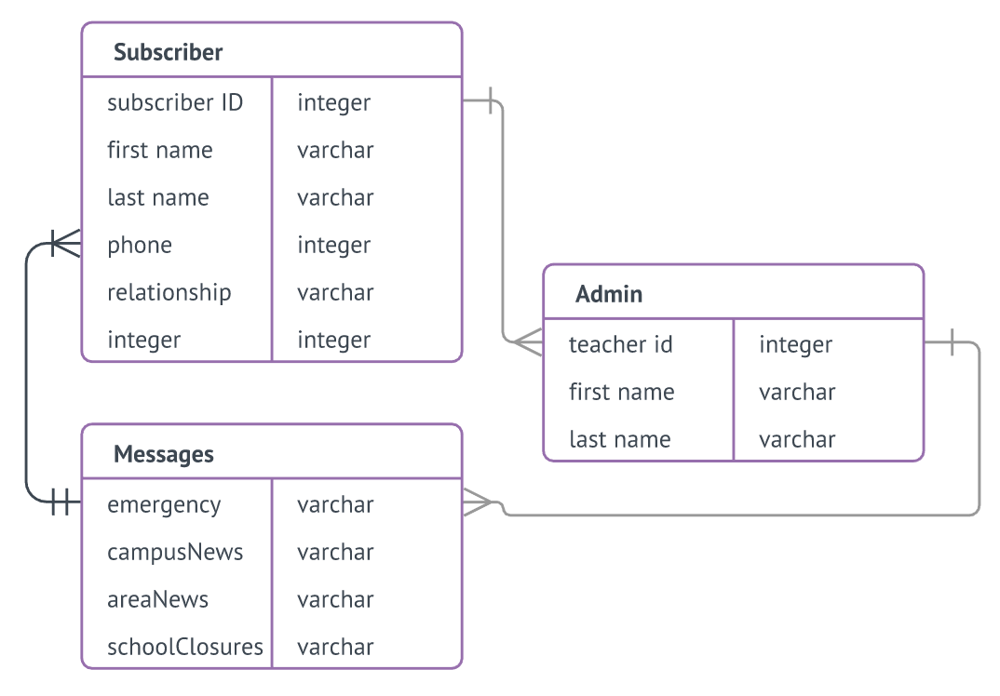

# [Heads Up](https://johnisabella.github.io/Heads-Up/)

## Description
Our app allows school districts to send mass messages to students and parents about school-related emergencies, closures, etc.

## Key Features
Key features go here...

## Tech Used
HTML5, CSS, Bootstrap, Javascript, MySQL, Node.js, Twilio

## Architecture Diagram
[]

# UI Mockups
[]

## API Docs
Student API and Database dependent on phone numbers.

## DB
[]

## Getting Started
Instructions for installing, running tests, seeding the DB, setting up the config file goes here

## Team Members

* Cesar Pocai
[]

* John Isabella
[]

* Gerard Louis
[]

* Chris Jezior
[]
